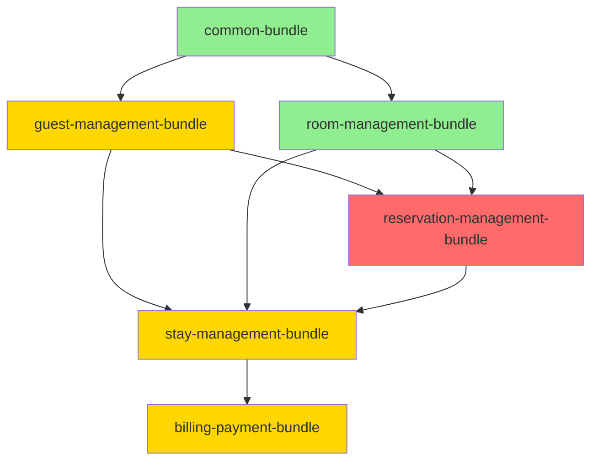

# OSGi Module Integration Analysis Report

> **Analysis Date:** 2026-01-21
> **Project:** hotel-smarttrack-cbse-osgi
> **Status:** ⚠️ **Multiple Integration Issues Found**

---

## Executive Summary

After a thorough analysis of the OSGi implementation against the [DEVELOPMENT_GUIDE.md](file:///d:/Dev/hotel-smarttrack-cbse/hotel-smarttrack-cbse-osgi/DEVELOPMENT_GUIDE.md), [SEED_DATA_SPEC.md](file:///d:/Dev/hotel-smarttrack-cbse/hotel-smarttrack-cbse-osgi/SEED_DATA_SPEC.md), and [project-details.md](file:///d:/Dev/hotel-smarttrack-cbse/project-details.md), I identified **critical issues** that will cause **runtime failures** when bundles attempt to integrate.

### Severity Overview

| Severity    | Count | Impact                                |
| ----------- | ----- | ------------------------------------- |
| 🔴 Critical | 3     | Cross-bundle integration will fail    |
| 🟠 Major    | 4     | Functionality gaps or spec violations |
| 🟡 Minor    | 3     | Cosmetic or documentation mismatches  |

---

## 🔴 Critical Issues

### 1. Seed Data ID Mismatch - Guest Bundle

**File:** [GuestManager.java](file:///d:/Dev/hotel-smarttrack-cbse/hotel-smarttrack-cbse-osgi/guest-management-bundle/src/main/java/com/hotel/smarttrack/guest/GuestManager.java)

**Expected (per SEED_DATA_SPEC.md):**
| ID | Name | Email | Phone |
|----|-------------|-----------------------|-------------|
| 1 | John Doe | john.doe@email.com | +1-555-0101 |
| 2 | Jane Smith | jane.smith@email.com | +1-555-0102 |
| 3 | Bob Wilson | bob.wilson@email.com | +1-555-0103 |
| 4 | Alice Brown | alice.brown@email.com | +1-555-0104 |

**Actual Implementation (lines 26-34):**

```java
Guest g = new Guest();
g.setName("Seed Guest");
g.setEmail("seed@guest.com");
// Only 1 guest created with wrong data!
```

**Impact:**

- `StayManager` tries to get `guestService.getGuestById(1L)` expecting **"John Doe"**
- Will throw `RuntimeException("Guest ID 1 not found")` on activation

---

### 2. Seed Data ID Mismatch - Reservation Bundle

**File:** [ReservationManager.java](file:///d:/Dev/hotel-smarttrack-cbse/hotel-smarttrack-cbse-osgi/reservation-management-bundle/src/main/java/com/hotel/smarttrack/reservation/impl/ReservationManager.java)

**Expected (per SEED_DATA_SPEC.md):**
| ID | Guest ID | Room Type ID | Room ID | Check-In | Status |
|----|----------|--------------|---------|------------|-----------|
| 1 | 1 (John) | 2 (Deluxe) | 3 (201) | 2026-01-25 | Confirmed |
| 2 | 2 (Jane) | 1 (Standard) | 1 (101) | 2026-01-26 | Confirmed |

**Actual Implementation (lines 28-34):**

```java
Reservation r = new Reservation();
r.setStatus("Reserved");  // Wrong status!
r.setNumberOfGuests(1);
r.setCheckInDate(LocalDate.now().plusDays(1));  // Dynamic date!
// NO Guest, RoomType, or Room references set!
```

**Impact:**

- Reservation has **no Guest assigned** → `reservation.getGuest()` returns `null`
- Reservation has **no Room assigned** → `reservation.getAssignedRoom()` returns `null`
- `StayManager.checkInGuest()` throws **"No room assigned to reservation"**

---

### 3. Missing Cross-Bundle References in ReservationManager

**File:** [ReservationManager.java](file:///d:/Dev/hotel-smarttrack-cbse/hotel-smarttrack-cbse-osgi/reservation-management-bundle/src/main/java/com/hotel/smarttrack/reservation/impl/ReservationManager.java)

**Expected (per DEVELOPMENT_GUIDE.md lines 178-209):**

```java
@Reference
private volatile GuestService guestService;

@Reference
private volatile RoomService roomService;
```

**Actual Implementation:**

```java
// NO @Reference annotations!
// NO service injection!
```

**Impact:**

- **Cannot create reservations with actual guests/rooms**
- `createReservation()` ignores `guestId` and `roomTypeId` parameters
- `getReservationsByGuest()` always returns empty list

---

## 🟠 Major Issues

### 4. Room Assignment Not Stored on Reservation Entity

**File:** [ReservationRepository.java](file:///d:/Dev/hotel-smarttrack-cbse/hotel-smarttrack-cbse-osgi/reservation-management-bundle/src/main/java/com/hotel/smarttrack/reservation/impl/ReservationRepository.java)

The `assignRoom()` method stores room IDs in a **separate map** but never updates the `Reservation.assignedRoom` field:

```java
// Line 62-64 - Only stores in separate map
public void assignRoom(Long reservationId, Long roomId) {
    assignedRoomByReservationId.put(reservationId, roomId);
    // MISSING: r.setAssignedRoom(room);
}
```

**Impact:** `reservation.getAssignedRoom()` always returns `null` even after `assignRoom()` is called.

---

### 5. Invoice Entity Simplified - Missing Original Fields

**File:** [Invoice.java](file:///d:/Dev/hotel-smarttrack-cbse/hotel-smarttrack-cbse-osgi/common-bundle/src/main/java/com/hotel/smarttrack/entity/Invoice.java)

**Expected (per SEED_DATA_SPEC.md lines 291-323):**

```java
// Should have:
private Stay stay;
private Guest guest;
private BigDecimal roomCharges;
private BigDecimal incidentalCharges;
private BigDecimal taxes;
private BigDecimal discounts;
private BigDecimal totalAmount;
private BigDecimal paidAmount;
private BigDecimal balanceDue;
private List<Payment> payments;
```

**Actual Implementation:**

```java
private Long invoiceId;
private Long reservationId;
private Long stayId;
private BigDecimal amount;        // Single amount only!
private String status;
private LocalDateTime issuedAt;
// Missing: stay, guest, roomCharges, incidentalCharges, taxes, payments, etc.
```

**Impact:**

- Cannot compute detailed breakdown (room + incidental + tax)
- `getInvoicesByGuest()` returns empty list (no guestId field)
- Doesn't match DEVELOPMENT_GUIDE.md template

---

### 6. BillingManager Has No StayService Reference

**File:** [BillingManager.java](file:///d:/Dev/hotel-smarttrack-cbse/hotel-smarttrack-cbse-osgi/billing-payment-bundle/src/main/java/com/hotel/smarttrack/billing/BillingManager.java)

**Expected (per SEED_DATA_SPEC.md lines 292-294):**

```java
@Reference
private volatile StayService stayService;
```

**Actual Implementation:**

```java
// NO @Reference annotations!
// Cannot calculate actual charges from stay data
```

**Impact:**

- `generateInvoice()` creates hardcoded $100 amount instead of calculating from stay
- Cannot retrieve incidental charges from stay records

---

### 7. createReservation() Ignores guestId and roomTypeId

**File:** [ReservationManager.java](file:///d:/Dev/hotel-smarttrack-cbse/hotel-smarttrack-cbse-osgi/reservation-management-bundle/src/main/java/com/hotel/smarttrack/reservation/impl/ReservationManager.java#L44-L59)

```java
public Reservation createReservation(Long guestId, Long roomTypeId, ...) {
    // guestId and roomTypeId are IGNORED!
    Reservation r = new Reservation();
    r.setCheckInDate(checkIn);
    r.setCheckOutDate(checkOut);
    r.setNumberOfGuests(numberOfGuests);
    r.setStatus("Reserved");
    // MISSING: r.setGuest(guest); r.setRoomType(roomType);
}
```

---

## 🟡 Minor Issues

### 8. Inconsistent Guest Status Values

**SEED_DATA_SPEC.md specifies:** "Active" (capitalized)
**GuestManager uses:** "ACTIVE" (uppercase)

This may cause status comparison issues in `getGuestsByStatus()`.

---

### 9. Room Status Uses "Available" but Guest Status Uses "ACTIVE"

Inconsistent casing conventions:

- Room: `"Available"`, `"Occupied"`, `"Under Cleaning"`
- Guest: `"ACTIVE"`, `"INACTIVE"`, `"BLACKLISTED"`

---

### 10. Missing IncidentalCharge Entity Seed Data Verification

The Stay bundle creates incidental charges in seed data, but this relies on Guest ID=1, Room ID=3, Reservation ID=1 existing with correct data first.

---

## Dependency Order Verification



| Bundle                        | @Reference Declarations                                                  | Status               |
| ----------------------------- | ------------------------------------------------------------------------ | -------------------- |
| common-bundle                 | N/A                                                                      | ✅ OK                |
| guest-management-bundle       | None (correct)                                                           | ⚠️ Seed data wrong   |
| room-management-bundle        | None (correct)                                                           | ✅ OK                |
| reservation-management-bundle | **Missing GuestService, RoomService**                                    | ❌ BROKEN            |
| stay-management-bundle        | GuestService, RoomService, ReservationService, BillingService (optional) | ⚠️ Will fail on seed |
| billing-payment-bundle        | **Missing StayService**                                                  | ❌ BROKEN            |

---

## Summary of Required Fixes

### High Priority (Blocking Integration)

1. **GuestManager**: Update seed data to create 4 guests with exact IDs 1-4 per SEED_DATA_SPEC.md
2. **ReservationManager**: Add `@Reference` for GuestService and RoomService, update seed data with proper cross-references
3. **ReservationManager**: Fix `assignRoom()` to update `Reservation.assignedRoom` field

### Medium Priority (Functionality)

4. **Invoice entity**: Consider restoring detailed fields or accept simplified version
5. **BillingManager**: Add `@Reference StayService` for proper charge calculation
6. **ReservationManager**: Implement `createReservation()` to use guestId/roomTypeId

### Low Priority (Polish)

7. Standardize status value casing (either all uppercase or all Title Case)

---

## Verification Checklist

After fixes are applied, verify:

- [ ] Felix starts without errors
- [ ] Console shows all bundles activated in order
- [ ] Each bundle shows correct seed data counts:
  - GuestManager: 4 guests
  - RoomManager: 3 room types, 5 rooms
  - ReservationManager: 2 reservations (with guest/room refs)
  - StayManager: 1 stay, 2 incidental charges
  - BillingManager: 1 invoice (linked to stay)
- [ ] Cross-bundle lookups work (test via Gogo shell)
